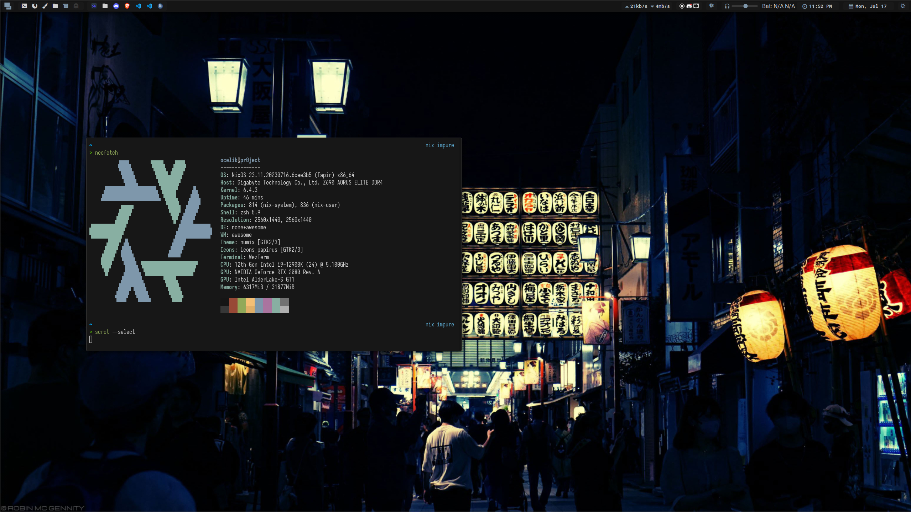

<h1 align="center">ocelik94/dotfiles</h1>

<div align="center">
  <div style="display: flex; align-items: flex-start;">
    
  </div>
</div>
<br/>

# 🗒 About
These are the files I use to set up my Linux machines with NixOS. Feel free to take anything that interests you.

- [configs](configs): special configuration e.g. awesomewm & neovim
- [pkgs](pkgs): package definitions (see next section)
- [modules](modules): common pieces of nixos or home-manager configuration
- [hosts](hosts): nixos configurations

# 📦 Exported packages

Run packages directly with:

```console
nix run github:ocelik94/dotfiles#pr0ject
```

Or install from the `packages` output. For example:

```nix
# flake.nix
{
  inputs.ocelik94-dotfiles.url = "github:ocelik94/dotfiles";

  # Override my nixpkgs
  inputs.ocelik94-dotfiles.inputs.nixpkgs.follows = "nixpkgs";
}

# configuration.nix
{ pkgs, inputs, ... }: {
  environment.systemPackages = [
    inputs.ocelik94-dotfiles.packages.${pkgs.system}.pr0ject
  ];
}
```

# 💾 Resources

There are several other configurations from which I learned and copied, in no particular order:

- [sachnr/dotfiles](https://github.com/sachnr/dotfiles)
- [viperML/dotfiles](https://github.com/viperML/dotfiles)
